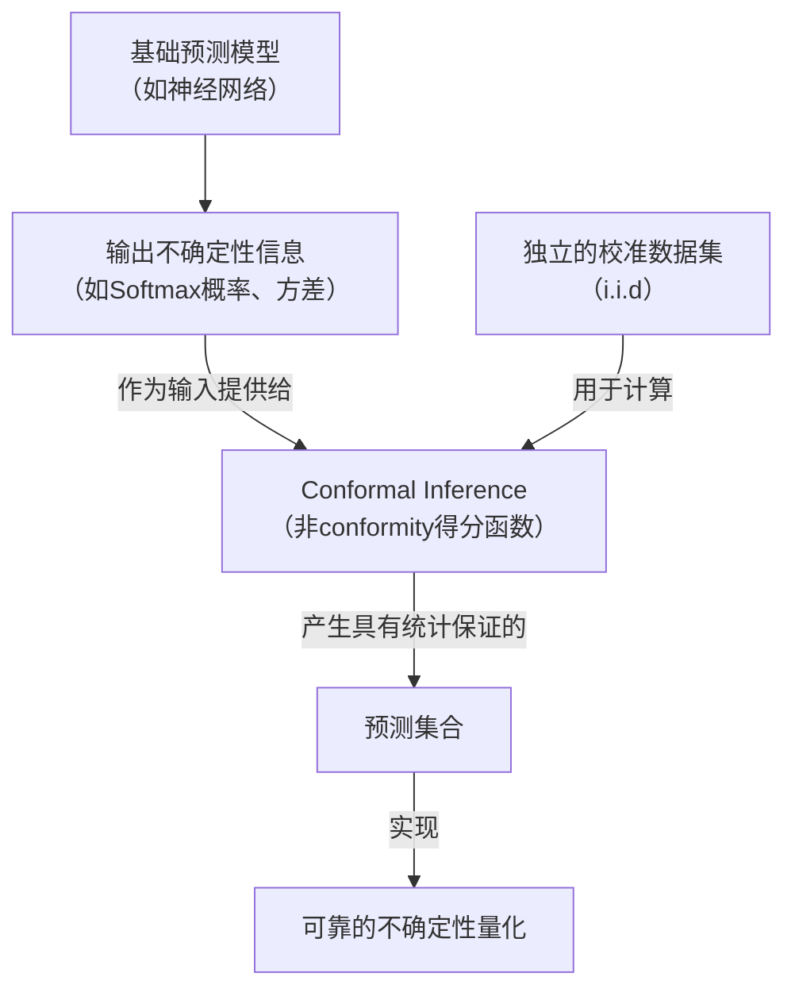

好的，这是一个非常深入且重要的问题。Conformal Inference（ conformal prediction， conformal推断）是不确定性量化（UQ）领域中一颗璀璨的明珠，它以一种非常独特且强大的方式来解决UQ的核心问题。

下面我将详细讲解它们之间的关系，包括核心思想、工作原理、优势以及与传统UQ方法的对比。

### 一、核心关系：从“概率分布”到“具有保证的集合”

*   **传统UQ**（如贝叶斯方法、深度学习）的目标通常是提供一个**概率分布** $P(y|x)$。例如，“给定这张图像，有80%的概率是猫，20%的概率是狗”。这种方法的正确性严重依赖于模型的假设（如先验、似然函数）是否正确。
*   **Conformal Inference (CI)** 的目标是提供一个**预测集合** $\hat{C}(x) \subseteq \mathcal{Y}$，并附带一个**有限的、分布无关的统计保证**。例如，“对于这张图像，我的预测集合是 {猫, 狗}，并且我保证这个集合有90%的概率包含真实标签”。

**最关键的关系在于：** CI **利用**（或“包装”）任何现有的预测模型（称为**非conformity得分函数**），无论其内部不确定性估计的质量如何，都能为其输出提供严格的、无需假设的置信保证。它更像一个**后处理校准框架**，而不是一个独立的模型。

---

### 二、Conformal Inference 的核心思想

CI 的工作流程可以概括为三个步骤，我们以分类任务为例：

1.  **定义非Conformity得分函数 (Nonconformity Score)**
    *   这是一个衡量“模型对某个预测感到多么不确信”的度量。**它可以直接使用模型输出的不确定性！**
    *   **例如**：对于一个分类模型，其输出概率为 $[p_1, p_2, ..., p_k]$。一个简单的非conformity得分是 $s(x_i, y_i) = 1 - p_{y_i}$，即1减去模型为**真实标签**分配的概率。得分越高，说明这个数据点越“反常”，模型越不确定。

2.  **在校准集上计算分位数**
    *   将一个有标签的**校准集**（与训练集独立同分布）输入模型，为每个样本计算其非conformity得分 $s_i = s(x_i, y_i)$。
    *   计算这些得分的 $(1-\alpha)$ 分位数 $\hat{q}$（例如，想要90%置信度，$\alpha=0.1$）。
    *   **直观理解**：$\hat{q}$ 代表了校准集中“典型”的不确定性阈值。大约 $(1-\alpha)$ 的样本其不确定性得分低于 $\hat{q}$。

3.  **为新的测试点构建预测集**
    *   对于一个新输入 $x_{test}$，我们**遍历所有可能的标签** $y \in \mathcal{Y}$。
    *   对于每一个候选标签 $y$，我们“假设”其真实标签就是 $y$，然后计算这个假设下的非conformity得分 $s_{test} = s(x_{test}, y)$。
    *   我们将这个假设的得分与校准集的分位数 $\hat{q}$ 比较。如果 $s_{test} \leq \hat{q}$，说明在这个假设下，$(x_{test}, y)$ 看起来和校准集中的“典型”样本一样可信，因此我们将 $y$ 纳入预测集。
    *   最终，预测集 $\hat{C}(x_{test}) = \{ y \in \mathcal{Y} \mid s(x_{test}, y) \leq \hat{q} \}$。

**提供的统计保证是：**
$$
P(y_{test} \in \hat{C}(x_{test})) \geq 1 - \alpha
$$
这意味着，在所有测试样本中，预测集包含其真实标签的概率至少是 $1-\alpha$。这个保证是**有限的**（适用于有限数据集）和**分布无关的**（对数据分布 $P$ 没有强假设），只要校准集和测试集是独立同分布的。

---

### 三、Conformal Inference 如何增强不确定性量化

CI 与 UQ 的关系是互补和增强的，如下图所示：

1.  **提供无分布保证**
    *   **问题**：贝叶斯神经网络或深度集成输出的概率不确定性可能没有被**校准**（miscalibrated）。它们可能过度自信或自信不足。
    *   **CI的作用**：CI不关心模型内部的不确定性估计是否完美校准。它只使用这些估计的**相对排名**（通过非conformity得分）。通过校準集上的分位数计算，CI能够将模型原始的、可能不可靠的不确定性输出，“转化”为一个具有严格统计保证的预测集合。**它让一个“烂”模型输出的不确定性也变得有用。**

2.  **将概率不确定性转化为集合不确定性**
    *   UQ模型输出的是一个分布，而决策者往往需要一个明确的“是或否”的答案。CI完美地架起了这座桥梁。
    *   **例子**：一个医学影像模型可能对某个病变输出 $[0.4, 0.35, 0.25]$（分别为“良性”、“恶性”、“不确定”）。这个输出本身难以直接用于决策。
        *   应用CI后，我们可能得到一个预测集 $\{$良性, 恶性$\}$（置信度90%）。这明确地告诉医生：“我有90%的把握认为这要么是良性，要么是恶性，你需要进一步检查来区分”。这是一个信息量巨大且可操作的结论。

3.  **区分不确定性的类型**
    *   **预测集的大小直接反映了认知不确定性**。
        *   **小集合**（如 {猫}）：模型非常确定，认知不确定性低。
        *   **大集合**（如 {猫, 狗, 狐狸}）：模型困惑，认知不确定性高。这可能是因为输入 $x_{test}$ 位于训练数据分布之外（OOD），或者本身就难以分类。
    *   **集合内部的概率分布反映了偶然不确定性**。
        *   如果预测集是 {猫, 狗}，且模型原始输出为 $P(猫)=0.51, P(狗)=0.49$，说明偶然不确定性很高（图像模糊，两者确实很像）。
        *   如果原始输出为 $P(猫)=0.99, P(狗)=0.01$，则说明认知不确定性高（模型很确定是猫，但CI的保证要求它必须把狗也包括进来，可能是因为校准集中有极端例子），这可能暗示OOD问题。

---

### 四、与传统UQ方法的对比

| 特性 | 传统UQ方法（贝叶斯、集成） | Conformal Inference |
| :--- | :--- | :--- |
| **输出** | 概率分布 $P(y\|x)$ | 预测集合 $\hat{C}(x)$ |
| **保证类型** | **渐近的、基于模型的** （假设模型正确，在数据无限时成立） | **有限的、分布无关的** （对任何有限数据集和任何模型都成立） |
| **核心需求** | 正确的模型假设（先验、似然） | 独立同分布的校准集 |
| **与模型关系** | **生成**不确定性估计 | **利用并校准**现有的不确定性估计 |
| **优点** | 提供完整的分布信息，可用于决策 | 提供严格的、无需假设的统计保证 |
| **缺点** | 保证依赖于可能不成立的假设 | 需要消耗一个额外的校准数据集 |

### 五、总结

**Conformal Inference 不是要取代传统的不确定性量化方法，而是它们的“完美搭档”。**

它的核心价值在于：**它将一个依赖于假设的、可能是错误的不确定性估计（软概率），变成了一个具有无分布、有限样本保证的、可操作的 uncertainty quantification（硬集合）。**

你可以这样理解：
*   **传统UQ模型**（如BNN）是一个优秀的**气象学家**，他根据自己的复杂模型告诉你“明天降水的概率是70%”。这个数字可能准，也可能不准。
*   **Conformal Inference** 是一个**严谨的统计学家**，他根据这个气象学家过去预报的记录（校准集）告诉你：“根据他过去的表现，当他给出70%的预测时，实际下雨的频率在65%-75%之间。因此，我们可以相信他这次的70%预报。”

在实际应用中，最佳实践是：
1.  首先建立一个尽可能好的预测模型，并让其输出某种不确定性度量（概率、方差等）。
2.  然后，使用一个独立的校准集和Conformal Inference框架，为这个模型的输出附加上严格的统计保证。
3.  最终，用户看到的是一个既来自强大模型，又拥有可靠性保证的不确定性量化结果，从而可以做出风险知情的决策。